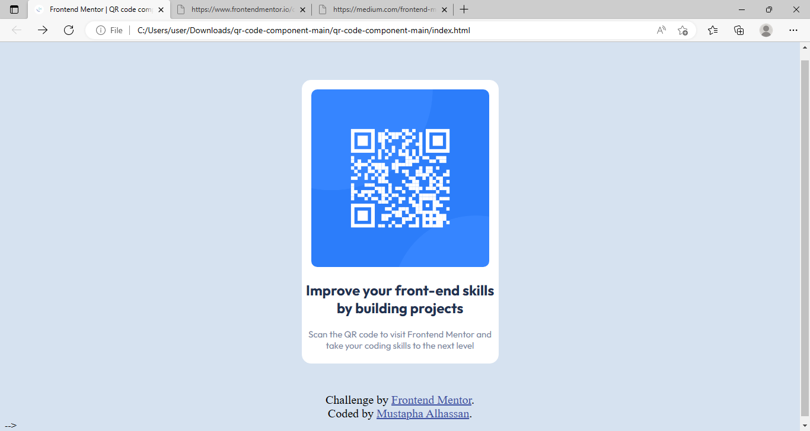

# Frontend Mentor - QR code component solution

This is a solution to the [QR code component challenge on Frontend Mentor](https://www.frontendmentor.io/challenges/qr-code-component-iux_sIO_H). Frontend Mentor challenges help you improve your coding skills by building realistic projects. 

## Table of contents

- [Overview](#overview)
  - [Screenshot](#screenshot)
  - [Links](#links)
  - [Built with](#built-with)
  - [What I learned](#what-i-learned)
  - [Continued development](#continued-development)
  - [Useful resources](#useful-resources)
- [Author](#author)


## Overview
 This is a Frontend Mentor challenge which encompasses designing a webpage containing a QR code.

### Screenshot




### Links

- Solution URL: [Add solution URL here](https://www.frontendmentor.io/solutions/frontend-mentor-qr-code-component-MAVoK71a2V)
- Live Site URL: [Add live site URL here]( https://mustapha62996.github.io/qr-code-webpage/)


### Built with

- Semantic HTML5 markup
- CSS custom properties
- Mobile-first workflow


### What I learned
 I learnt how to use Google Fonts more efficiently
 <head>
 <link rel="preconnect" href="https://fonts.googleapis.com">
<link rel="preconnect" href="https://fonts.gstatic.com" crossorigin>
<link href="https://fonts.googleapis.com/css2?family=Outfit:wght@400;700&display=swap" rel="stylesheet">
</head>
<style>
  .container{
    font-family: 'Outfit', sans-serif;
  }
</style>

```

### Continued development

I'm going to improve myself on Responsive CSS, especially areas like
- Flexbox
- CSS Grid layout
- Media Queries


### Useful resources

- (https://www.w3schools.com/css/css_font_google.asp) This website(w3schools.com) helped me get a better understanding of using Google Fonts in CSS.


## Author
- Name - Mustapha Alhassan
- Frontend Mentor - [@mustapha62996](https://www.frontendmentor.io/profile/mustapha62996)
- Twitter - [@hassmustapha787](https://www.twitter.com/hassmustapha787)

